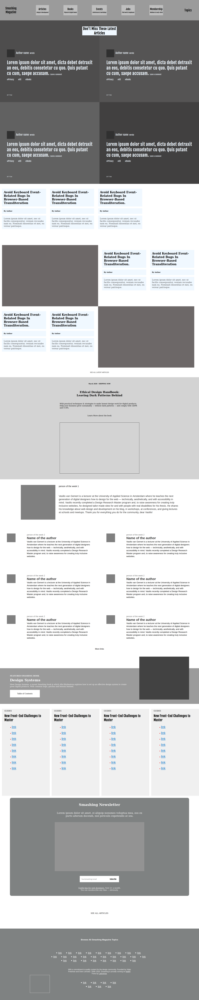

# Design Teardown : Creating the Heat-map of a web magazine


## Description
In this project, we tried to re-create the heat-map of the Smashing magazine web page (https://www.smashingmagazine.com/). The purpose of this exercise is to learn about the UX (user experience) concepts and its best practices.


## Built With
- HTML & CSS
- CSS grid
- CSS flex box


## Usage
```Git
git clone https://github.com/CalyCherkaoui/Smashing-HeatMap.git
cd Smashing-HeatMap
git checkout heatmap
firefox index.html
```


## Demo
https://rawcdn.githack.com/CalyCherkaoui/Smashing-HeatMap/60093f2299f22a267f8f8f56ac99fdbc9f39aff7/index.html


## Authors

👨 **Raul Figueroa**
- Twitter: https://twitter.com/raul_figueroa17
- Github: https://github.com/tacodtripe
- Linkedin: https://www.linkedin.com/in/luis-raul-figueroa-soto-63411118a/

👩 **Houda Cherkaoui**
- Twitter: https://twitter.com/Houda59579688
- Github: https://github.com/CalyCherkaoui/
- Linkedin: https://www.linkedin.com/in/houda-cherkaoui-64106395/


## Contributing
Pull requests are welcome. For major changes, please open an issue first to discuss what you would like to change.
Support this project with a ⭐️ and let us now if you would like to become a contributor!


## A screenshot of the project:

